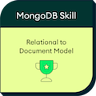

# 👋 심현섭

---

## ✨ About Me

안녕하세요. **심현섭**입니다.  
제 이름의 뜻은 **현(炫): 밝을 현**, **섭(燮): 불꽃 섭**으로, 저는 저 자신을 **밝은불꽃(Bright Flare)** 이라고 소개합니다.  
**밝고 긍정적이며, 때로는 불꽃처럼 열정적인 태도**로 사람과 일 모두에 진심을 다하려고 노력합니다.  

---

 

## 🔍 What I'm into

- DDD
- OOP
- RESTful API
- Clean Architecture
- Event-Driven Architecture
- Microservices
- 🦞 OpenClaw, AI, Claude Code, Codex, Gemini

---

 

## 📄 Certificates

 

---

 

## Blog Posts ✍️

- [bright-flare.github.io](https://bright-flare.github.io)
- [Java를 주로 다루는 개발자가 생각하는 Kotlin 장점 🌼](https://oliveyoung.tech/2024-12-08/kotlin-advantages/?keyword=kotlin)
- [파트너플랫폼 스쿼드 코드 컨벤션 소개 🌼](https://oliveyoung.tech/2023-12-05/partner-platform-code-convention/?keyword=%EC%BD%94%EB%93%9C%20%EC%BB%A8%EB%B2%A4)

---

 

## 🏢 Current Company

| Company | Job Title | Period |
|---|---|---|
| CJ Oliveyoung | Software Engineer | 2022년 9월 ~ 현재 |

---

 

## 📫 Contact

